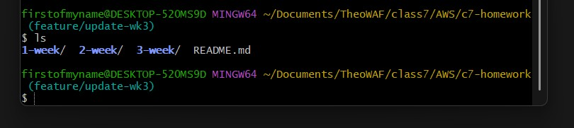
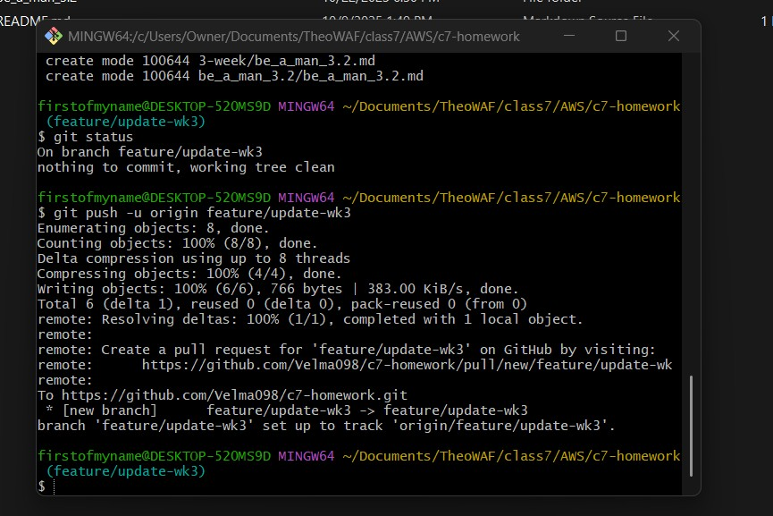
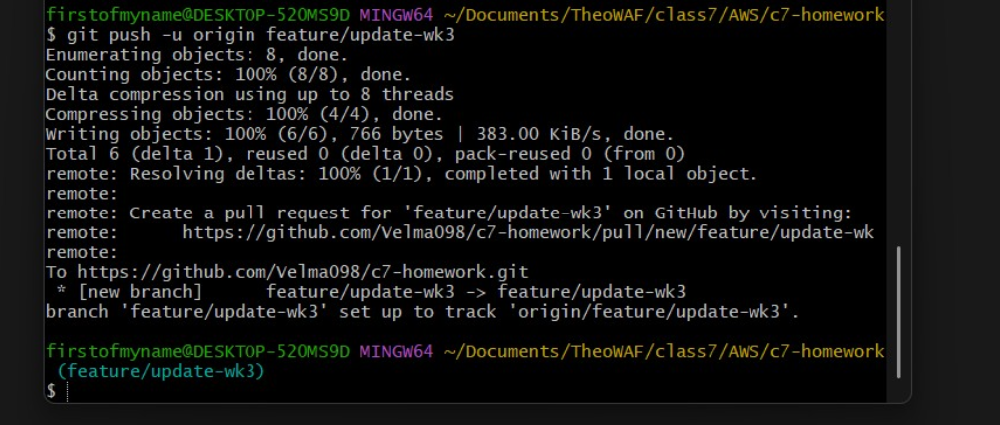
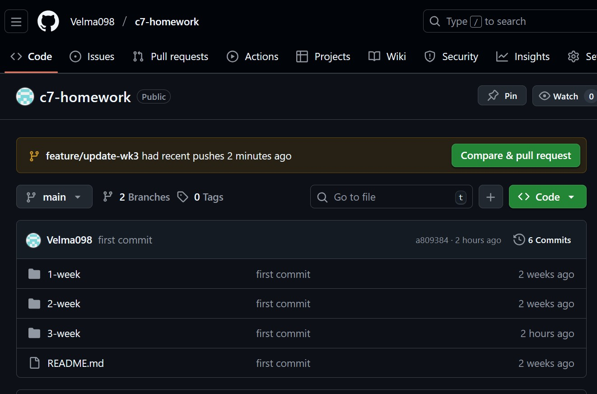
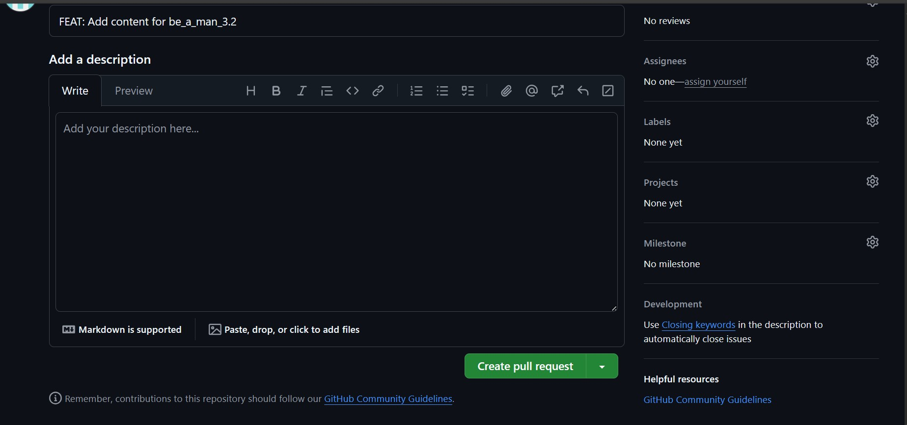
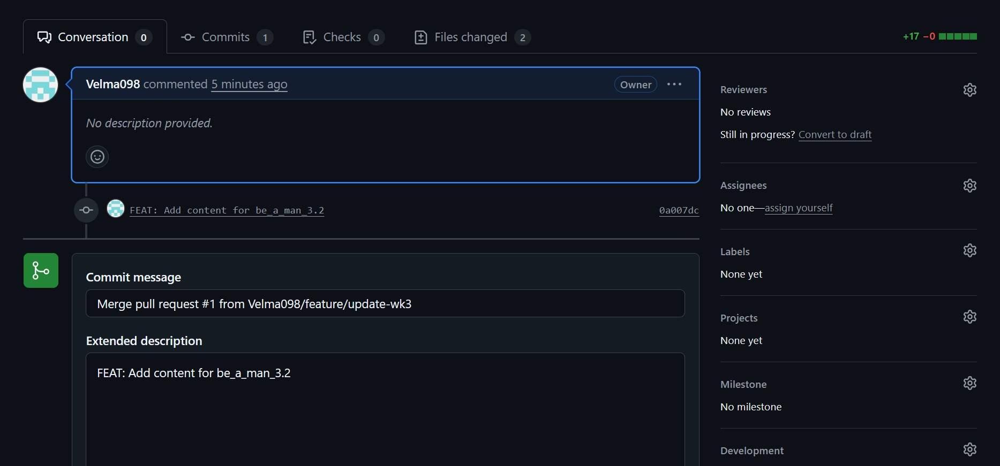
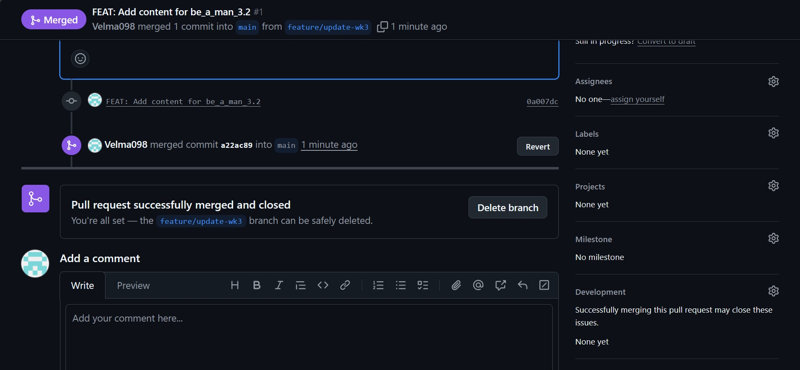
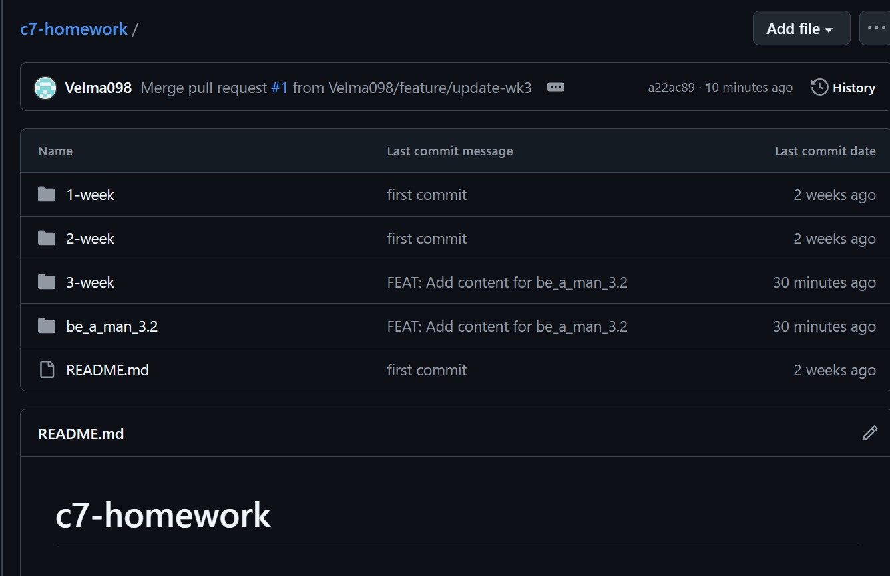
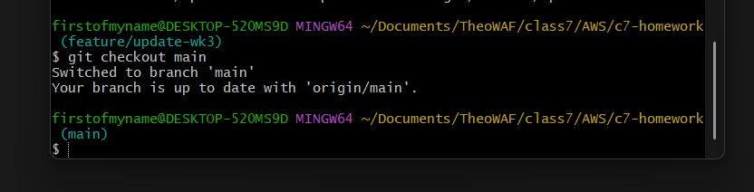
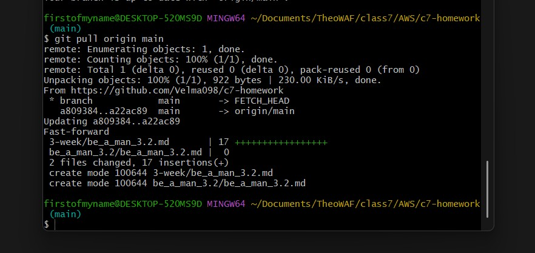

###   Github Merge Request

Follow instructions carefully for a merge request

### Step 1: Create a Branch

From your local machine project main directory create branch to hold changes.

Bash Commands:

---
### This creates a new branch called " feature/update-wk3"
     git checkout -b feature/update-week3 
---

### Step 2: Make your changes

You can make your necessary changes for your directory, add a file or a picture or some instructions.

Step 3

### Step 3: Stage and Commit

Save work to branches history

Bash Commands:

---
# Stage all new modified files for commit 
     git add .

# Commit the staged files with a descriptive message
     git commit -m "FEAT: Add content for bam3.2"
---

### Step 4: Push to GitHub

Send your new branch and its commits to the remote repository on GitHub.

Bash Commands:

---
# Push the branch and set up remote tracking
     git push -u origin feature/update-wk3
---

### Step 5: Create the Pull Request

Go to your repository on github, when you see a yellow notification bar with your new branch name, prompting you to create a pull request.

Click the **"Compare & pull request"** button. This will take you to a new page where you can give your pull request a title and description.

### Step 6: Merge Pull Request

On the pull request page, you can see all the changes you made, to your branch that you are about to merge into the main branch. If everything looks good and there are no conflicts, you can merge it.

Click -> Create pull request <-

Click -> Confirm merge <-

Success!!!!

Confirm merge in repo ' new file alert: be a man 3.2 is in the repo

### Step 7: Clean up

After a successful merge, it's good practice to delete the branch.

---
### Post-Merge Branch Cleanup

This procedure outlines the necessary steps to synchronize your local repo and remove the branch(s) no longer in use, after a feature/temporary branch has been successfully merged into the `main` branch on the remote repository.

### Step 1: Return to Main Branch

Change your local working directory to 'main' branch.

Bash Commands:

---
      git checkout main
--- 
 
 ### Step 2: Synchronize the Local Main Branch

 Update local 'main' branch to also include changes done on remote repo ('origin'). This brings local version up to date with remote version.

 Bash Commands:

 ---
      git pull origin main
 ---

 

 ###  Step 3: Delete the Local Feature Branch

 Remove the branch that you created, the feature branch is now part of the main branch therefore we no longer need feature branch.

 Bash Commands:

 ---
       git branch -d feature/update-wk3
 ---

 **Note:** Use the `-d` (delete) flag for this operation. Git will prevent deletion if the branch contains unmerged changes, acting as a safety measure. Forcing a deletion requires the `-D` flag.

